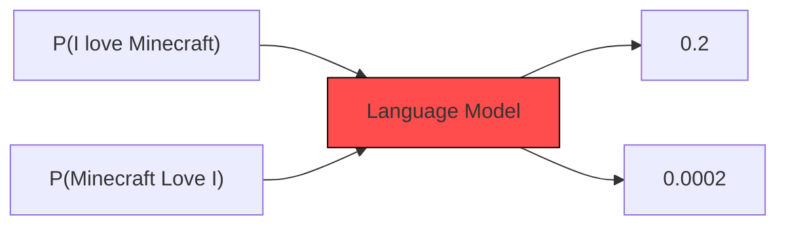

# Lec 1
## Introduction

# What a Language Model(LM)?
- Gives probability distribution over a sequence of tokens (Numbers, subsequence, words,characters,subwords,etc) .

- When we design an LM, we create a "Vocabulary"  ; Created from documents(called corpus)
- Plural of Corpus is Corpora.

- Unique tokens in the vocabulary are called Types (Read as, Types of unique stuff stored in the LM)
- LMs can Generate Text:
  - i.e. Consider a sequence of tokens $\{x_1,x_2,x_3,...,x_l}$ where  $\{x_1,x_2,x_3,...,x_l}$ are in vocablary V.
  - Notation: $P(x_1,x_2,...,x_l)=P(x_{1:L})$
  - Using the chain rule of probability:
    - $P(x_{1:L}) = P(x_1) . P(x_2 | x_1) . P(x_3 | x_1,x_2) ... P(x_l | x_{l-1}) =\prod_{i=1}^{L} P(x_i \mid x_{1:i-1}) $
  - For text generation, the next token is sampled from this probability distribution.
  - $x_i$ ~ $P(x_i | x_{1:i-1})$
  - This type of model is called Auto-Regressive LMs ; calculate this distribution effectively, e.g. using 'Deep' Neural Networks

## Large Language Models
- The 'Large' in terms of model's size ( Number of parameters) and massive size of training dataset.
  - Fun fact: Model size have increased by an order of 5000x over last 4 years (till 2021)

- GenAI involves use of deep Neural Netowrks to create new content, such as text,images, or various forms of media.
- In 2017, The research paper of Transformers (2017; Attention is all you need) and BERT: Pre-training of Deep Bidirectional Transformers for Language Understanding(2018)
  - BERT achieved SOTA(State-Of-The-Art) on 11 NLP tasks
  - Thought that BERT was too big for back then so they made smaller models like DistilBERT,TinyBERT,MobileBERT.
- OpenAI wrote the first GPT Paper(2018), Ilya Sutskever ( Co author of AlexNet paper, Chief Advisor of OpenAI, one of the founders of OpenAI)
  - Only focused on Decoder Part of the Transformer Architecture.
  - GPT-2 introduced in 2019 (13x increase in parameters ; 1.5 B )  ; Minimal Changes ; Increase in context length from 512 tokens(GPT1) to 1024 tokens(GPT2)
## Prompting Strategies:
- For downstream tasks like Translation and summarization, `zero-shot prompting` worked the best.

- In 2019,Google came up with the model T5(Text To Text Transfer Transformer (cuz it has 5 T's; Alliteration and all, very poetic))
- T5 was an encoder-decoder model; They unified all tasks as a text to text problem ; Strategy similar to BERT
- In 2019, Meta came up with RoBERTa ; Found that BERT was undertrained ;
- Proposed XLM Model (Cross-lingual LM Pretraining) ; Obtained SOTA on  cross-lingual classification and unsupervised and supervised Machine Translation.
- IN 2020, OpenAI scaled up to 175B parameters; (Paper Name- LMs are few short Learners) ; Observed phenomena of in-context learning ; During this time, stopped being OpenSource
- **Incontext Learning**
  - During inference time , give an example to the LM for downstream task and without any gradient update in the model, it should cater to the examples well and perform significantly well on downstream tasks.

- In 2020: Google came with idea of PaLM (Paper: PaLM: Scaling Language Modelling with Pathways)
- In 2022: Meta Promotes Open-Sourcing ; OPT was launched. (OPT: Open Pre-Trained Transformer Language Models) ; A suite of decoder only models from 125M to 175B parameters. Open Sourced.
- Feb 2023: Google Released Bard ; Meta started LLaMA family ; Anthropic started in March 2023; March 2023: OpenAI released GPT-4; Microsoft released Phi-1. ; Mistral released Mistral- 7B model ; Elon released Grok AI ; Dec 2023 - Google Gemini was released.
- In 2024 - Gemma2,GPT4o , Llama3,Codestral Mamba from Mistral, Phi-3, Llama 3.1 ,Mistral Large 2

- LLMs show emergent capabilities, not observed previously in small LMs.
  - Ex: In-Context Learning: A pre-trained LM can be guided with only prompts to perform different tasks (without task specific fine tuning)
- Also has risks:
  - Reliability and Disinformation - LLMs often hallucinate ; Social Bias ; Toxicity- generates toxic/hateful content
  -  Security concern- An attacker can perform a data poisoning attack.

  
`Note to self: Experiment with models on HuggingFace,Kaggle,Google Colab ; Read the research papers, atleast overview`
