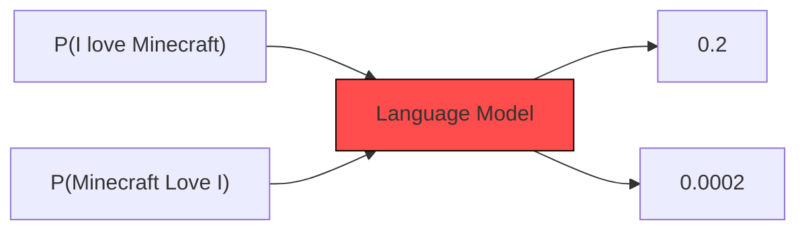
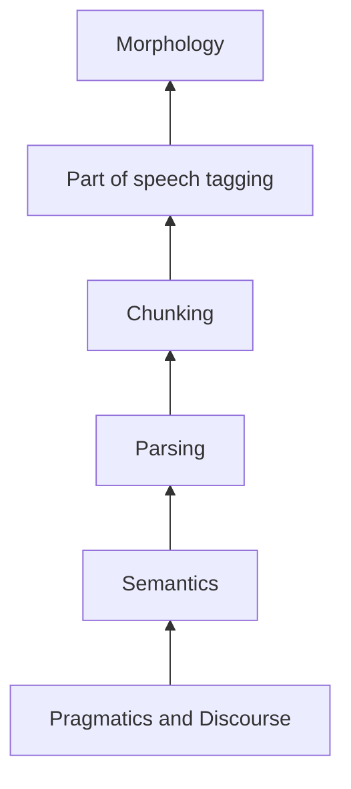

# Lec 1
## Introduction

# What a Language Model(LM)?
- Gives probability distribution over a sequence of tokens (Numbers, subsequence, words,characters,subwords,etc) .

- When we design an LM, we create a "Vocabulary"  ; Created from documents(called corpus)
- Plural of Corpus is Corpora.

- Unique tokens in the vocabulary are called Types (Read as, Types of unique stuff stored in the LM)
- LMs can Generate Text:
  - i.e. Consider a sequence of tokens $\{x_1,x_2,x_3,...,x_l}$ where  $\{x_1,x_2,x_3,...,x_l}$ are in vocablary V.
  - Notation: $P(x_1,x_2,...,x_l)=P(x_{1:L})$
  - Using the chain rule of probability:
    - $P(x_{1:L}) = P(x_1) . P(x_2 | x_1) . P(x_3 | x_1,x_2) ... P(x_l | x_{l-1}) =\prod_{i=1}^{L} P(x_i \mid x_{1:i-1}) $
  - For text generation, the next token is sampled from this probability distribution.
  - $x_i$ ~ $P(x_i | x_{1:i-1})$
  - This type of model is called Auto-Regressive LMs ; calculate this distribution effectively, e.g. using 'Deep' Neural Networks

## Large Language Models
- The 'Large' in terms of model's size ( Number of parameters) and massive size of training dataset.
  - Fun fact: Model size have increased by an order of 5000x over last 4 years (till 2021)

- GenAI involves use of deep Neural Networks to create new content, such as text,images, or various forms of media.
- In 2017, The research paper of Transformers (2017; Attention is all you need) and BERT: Pre-training of Deep Bidirectional Transformers for Language Understanding(2018)
  - BERT achieved SOTA(State-Of-The-Art) on 11 NLP tasks
  - Thought that BERT was too big for back then so they made smaller models like DistilBERT,TinyBERT,MobileBERT.
- OpenAI wrote the first GPT Paper(2018), Ilya Sutskever ( Co author of AlexNet paper, Chief Advisor of OpenAI, one of the founders of OpenAI)
  - Only focused on Decoder Part of the Transformer Architecture.
  - GPT-2 introduced in 2019 (13x increase in parameters ; 1.5 B )  ; Minimal Changes ; Increase in context length from 512 tokens(GPT1) to 1024 tokens(GPT2)
## Prompting Strategies:
- For downstream tasks like Translation and summarization, `zero-shot prompting` worked the best.

- In 2019,Google came up with the model T5(Text To Text Transfer Transformer (cuz it has 5 T's; Alliteration and all, very poetic))
- T5 was an encoder-decoder model; They unified all tasks as a text to text problem ; Strategy similar to BERT
- In 2019, Meta came up with RoBERTa ; Found that BERT was undertrained ;
- Proposed XLM Model (Cross-lingual LM Pretraining) ; Obtained SOTA on  cross-lingual classification and unsupervised and supervised Machine Translation.
- IN 2020, OpenAI scaled up to 175B parameters; (Paper Name- LMs are few short Learners) ; Observed phenomena of in-context learning ; During this time, stopped being OpenSource
- **Incontext Learning**
  - During inference time , give an example to the LM for downstream task and without any gradient update in the model, it should cater to the examples well and perform significantly well on downstream tasks.

- In 2020: Google came with idea of PaLM (Paper: PaLM: Scaling Language Modelling with Pathways)
- In 2022: Meta Promotes Open-Sourcing ; OPT was launched. (OPT: Open Pre-Trained Transformer Language Models) ; A suite of decoder only models from 125M to 175B parameters. Open Sourced.
- Feb 2023: Google Released Bard ; Meta started LLaMA family ; Anthropic started in March 2023; March 2023: OpenAI released GPT-4; Microsoft released Phi-1. ; Mistral released Mistral- 7B model ; Elon released Grok AI ; Dec 2023 - Google Gemini was released.
- In 2024 - Gemma2,GPT4o , Llama3,Codestral Mamba from Mistral, Phi-3, Llama 3.1 ,Mistral Large 2

- LLMs show emergent capabilities, not observed previously in small LMs.
  - Ex: In-Context Learning: A pre-trained LM can be guided with only prompts to perform different tasks (without task specific fine tuning)
- Also has risks:
  - Reliability and Disinformation - LLMs often hallucinate ; Social Bias ; Toxicity- generates toxic/hateful content
  -  Security concern- An attacker can perform a data poisoning attack.

  
`Note to self: Experiment with models on HuggingFace,Kaggle,Google Colab ; Read the research papers, atleast overview`

---

Lec2: Intro to NLP

What is a Natural Language?  

- Any language that has evolved naturally in humans through use and repetition without conscious planning or pre-meditation.

What's NLP?

- Natural Language Practic-  just kidding, I just took MLP course in my coursework and it was good yet a bit theory-heavy 0_0 ; its leaking from there to here.
- NLP is a field of computer science ,AI and Computational linguistics concerned with the interactions between computers and human languages.
  - Roots started with Turing ; Did first NLP experiment. Proposed the Turing Test
  -  Noam Chomsky's Syntatic Structures revolutionized Linguistics with 'universal grammar'
 

- NLP is challenging as it has a lot of ambiguity.
- Pragmatics - [Link](https://en.wikipedia.org/wiki/Pragmatics)
- Non Standard English - Ex: SLAYYY(kill / You rocked it) , neversaynever
- Segmentation issues; Lets eat grandma vs Lets eat, grandma.
- Idioms/Multiwords
- Neologisms: Unfriend, retweet,bromance
- World Knowledge; in one context; 2 people may be sisters or mothers.

## Components of NLP
- Natural Language Understanding
- Natural Language Generation

### NLP Layers:

- Understanding semantics is a non-trivial task ; need a series of incremental steps to achieve this. ; Happens in layers

### Word and Token
- **Word** : Smallest sequence of phenomes of a spoken language that can be uttered in isolation
- **Word segmentation /Tokenization** : Breaking a string of characters into a sequence of words.
- **Token** : Smallest sequence of graphemes that are delimited with some predefined characters (space,comma,fullstop,etc).
- Urls cannot be split into multiple tokens

### Morphology- Study of words
- Field of linguistics that studies the internal structure of words
- Defines word formation rule from the root word.
- Morpheme is the smallest linguistic unit that has semantic meaning,
- English,Chinese,etc are morphologically-poor languages.
- Hindi,Turkish,Hungarian are termed as morphologically-rich languages.

### The various -nyms
- Hypernyms : It is a word that represents a broader, more general category that includes other, more specific words called hyponyms
- Meronyms : Specifies a part of something but refers to the whole of that thing.
- Holonym : It is a word that describes a whole thing which also has smaller parts with different names. "Dog" is a holonym of "fur" and "wagging tail.". (Holonym of one is meronym of the other; "car" and "wheel" - Holonym ; "wheel"  is meronym of "car")
- Hyponyms:  Hyponyms are words that represent specific instances or subtypes of a more general category (ex: Dog-animal)

### Chunking 
- Identification of non-recursive phases(noun,verb,etc)
- Syntax Processing : Validate the grammar structure of sentence; the sequence of words must follow the grammatical structure of language to form a valid sentence.

### Semantics

- Concerned with meaning of words and how to combine words to make meaningful sentences and phrases.

- 3 Types:
  1. Decompositional: What the components of meanings in a word are ; Dived menaings of words into components
  2. Ontological: How the meaning of word relates to meanings of other words 
  3. Distributional: What contexts the word is found in, relative to other words. ; Meaning of words can be derived from distributional properties in large corpora of text.

 - Discourse:
   - Processing of sequence of sentences.
  
### Semantic Role Labelling(SRL):
- Identify the semantic role of each argument (noun phrase) w.r.t the predicate of the sentence.

### Textual Entailment

- Determing whether one natural language sentence entails (implies) another under an ordinary interpretation.

### Co-reference Resolution
- Two referring expressions used to refer to the same entity are said to co-refer

### Information Extraction
- Named Entity Recognition(NER): Identify name
- Relation Extraction: Relation among entities

### Sentiment Analysis
- Extract polarity orientation of the subjectivity

## Machine Translation
- Given a sentence in source language L1, convert it to target language L2, such that the semantic(adequacy and fluency) is preserved.

## Summarization
- Given a document, summarize the semantics(Extract relevant info) in shorter length text
- Extractive summarization - Identify imp sentences and just copy and paste em.
- Abstractive summarizaiton- Understand the imp semantics and rewrite them
- Aspect based summarization - Given an aspect, summarize doc with that aspect.

---

## Upon revisting
- Did not know what hypernyms, meronyms, holonym and hyponyms meant. An appropriate section has been added above for them.
