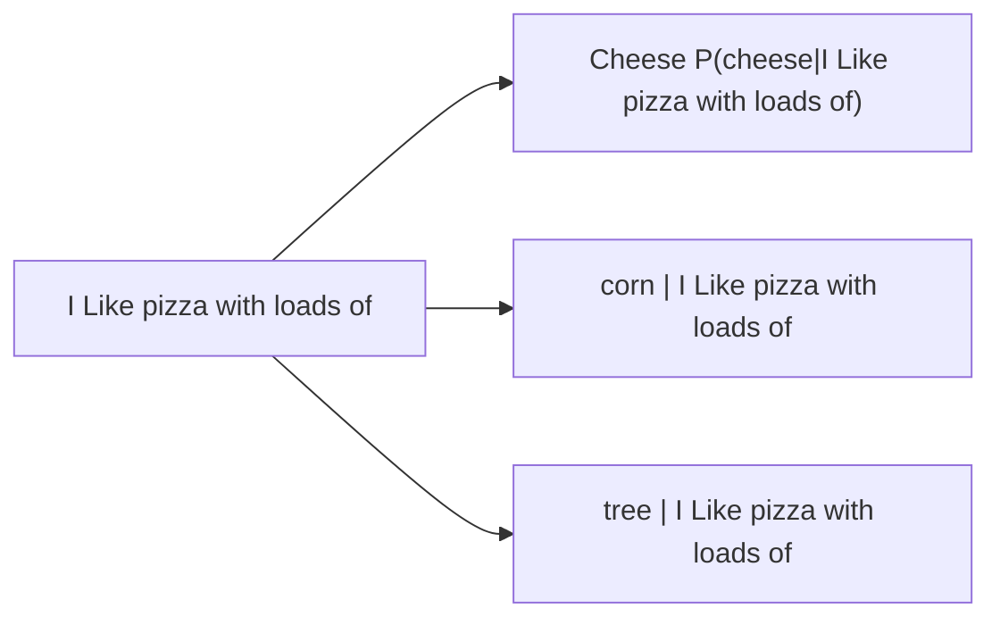

## Week 2 Notes:

### Lec 3

### Shannon's entropy:
- Shannon's entropy, in information theory, quantifies the average level of "information," "surprise," or "uncertainty" inherent in the values of a random variable. It's a measure of how unpredictable a random variable is, with higher entropy indicating greater unpredictability.
- Measured using $H(x) = - \sum p(x) log_2 p(x)$

### Next word prediction:

### Probabilistic LM: Applications
Can be used to determine the most plausible sentence by assigning a probability to sentences

- Speech Recognition
  - P(I bought fresh mangoes from the market) >> P(I bot fresh man goes from the mar kit)
- Machine Translation
  - Translation from one language to another language
    - P(Heavy rainfall) >> P(Big Rainfall)
    - P(Family gatherings) >> P(Family meetings)
    - P(The festival of lights ) >> P(The festival of lamps
- Context Sensitive Spelling correction
- Natural Language generation

### Probabilistic Language Models
Goal: Calculate the probability of a sentence or sequence consisting of n words
$P(W)= P(w_1,w_2,w_3,...,w_n)$

Related Task: Calculate the probability of the next word conditioned on the preceding words
- $P(w_6 | w_1,w_2,w_3,w_4,w_5)$

### Probability of a sentence
- How to compute the probability of a sentence?
 - **Chain Rule of Probability**

## Probability of a sequence

$P(w_1,w_2,..,w_n)= \prod_i  P(w_i| w_1 w_2 ... w_{i-1})$

Example: $P(W) = P("The monsoon season has begun")
               = P("The","Monsoon","Season","Has","Begun")
               = P(The) P(monsoon |The) P(season | The monsoon) P(has | The monsoon season) P(begun | The monsoon season has)$

P(season |The monsoon ) = $\frac{Count("The monsoon season")} {Count("The monsoon")}$

Problem of above method: Enough data is not available to get an accurate estimate of the above quantities
Solution: Markov Assumption

### Markov Assumption:
- First order assumption: Transition is dependent on only the previous state
-  Second order assumption: Transition is dependent on only the previous two states
-  and so on...

-  Generalized assumptipn: Every next state depends only on the previous k states.

N-Gram Language Models
- An N-Gram model considers only the preceding N-1 Words
  - Unigram : P(begun)
  - Bigram : P(begun | the)
  - Trigram: P(begun | the monsoon)
 
Relation between Markov Model and Language Model:
- An N-Gram Language Model is equivalent to (N-1) order Markov Model

Estimate N-Gram Probabilities:
- Maximum likelihood estimate:
  - Used to estimate the parameters of a statistical model
  - Determine the most likely values of the parameters that would make the observed data most probable
    - Ex: Bigram probabilites can be computed as follows ;  $P(w_i | w_{i-1}) ) = \frac {count(w_{i-1} , w_i} {count(w_{i-1})}$  
### Limitations with MLE Estimation:

Problem: N-grams only work well for word prediction if the test corpus looks like the training corpus. It is often not the case in real scenarious (data sparsity problem)

Zero probability n-grams occur; As a result the probabilty of test set will be 0.

- In bigram probability table, if it is zero but it will occur somewhere, it is a contingent zero.
-It  refers to the zero probability assigned to an N-gram (a sequence of n words) that was not encountered during training, but could potentially occur in real-world text

Limitations of N-Gram Language Models:
- An insufficient model of lanugage since they are not effective in capturing long-range dependencies present in language.

## Out Of Vocabulary 
- OOV Tokens are tokens present in test set but not in train set; deal with them  by having proxies in the train set; but what is generally done is we maintain another list called Lexicon;
- Lexicon is subset of vocabulary ; tokens are stored which are above a certain threshold.
- Vocabulary  - Lexicon = set of all unknown tokens.
- There is a token called UNK for Unknown ; corresponds to all entries in vocabulary whose frequency is below the threshold.
- We need smoothing ; Laplace smoothing in fact ; AKA Add-One-Estimation
  - Simply increase all counts by one 

MLE estimate in case of bigram model:
$P_{MLE}(w_i | w_{i-1}) ) = \frac {count(w_{i-1} , w_i} {count(w_{i-1})}$  
 Add-1 Estimate:
 $P_{Add-1}(w_i | w_{i-1}) ) = \frac {count(w_{i-1} , w_i) + 1 } {count(w_{i-1}) + |V| }$  

 Effective bigram count:
 $\frac {c^* (w_{n-1} w_{n})} {c(w_{n-1})} =  \frac {c(w_{n-1} , w_n) +1} {c(w_{n-1}) + |V|}$

### More general smoothing techniques
#### Add-K Smoothing
  - $P_{Add-k}(w_i | w_{i-1}) ) = \frac {count(w_{i-1} , w_i) + k } {count(w_{i-1}) + k|V| }$  
  - $P_{Add-k}(w_i | w_{i-1}) ) = \frac {count(w_{i-1} , w_i) + m/ |V| } {count(w_{i-1}) + m }$  

 m=kV

#### Unigram prior smoothing:
  - P_{Unigarm Prior}(w_i | w_{i-1}) ) = \frac {count(w_{i-1} , w_i) + m P(w_i)} {count(w_{i-1}) +m}$

Any optimal value for k or m can be determined using a held-out dataset.

### Back-off and Interpolation

- As N grows larger, the N gram model becomes more powerful. However, its capability to accurately estimate parameters decreases due to data sparsity problem
- When we have limited knowledge about larger contexts, can be helpful to consider less context.

#### Backoff :
- Opt for a trigram when there is sufficient evidence, otherwise use bigram , otherwise unigram

#### Interpolation
- Mix unigram,bigram,trigram
- Interpolation generally results in improved performance

Linear Interpolation:

- $\hat{P}(w_n | w_{n-2} w_{n-1}) = \lambda_1 P(w_{n} | w_{n-2} w_{n-1}) + \lambda_2 P(w_n| w_{n-1}) + \lambda_3 P(w_n)$
  - $\sum_i \lambda_i =1$

