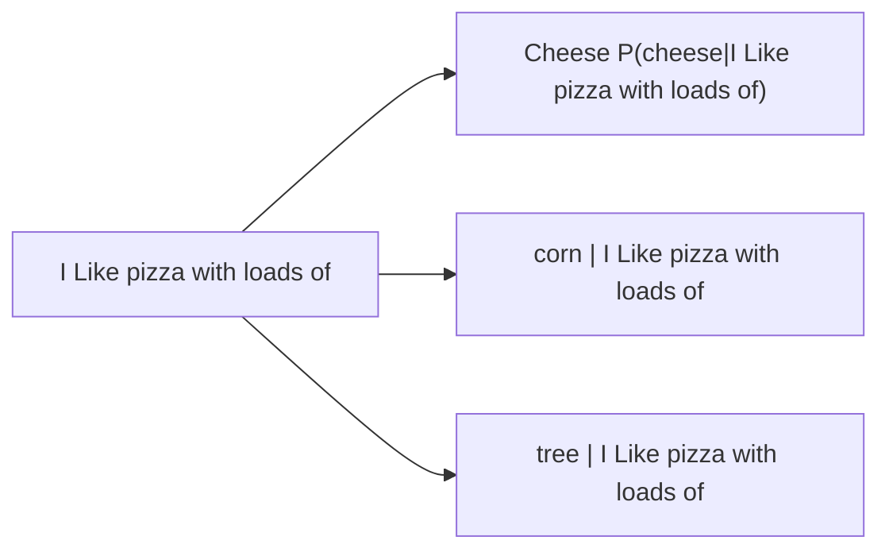

## Week 2 Notes:

### Lec 3

### Shannon's entropy:
- Shannon's entropy, in information theory, quantifies the average level of "information," "surprise," or "uncertainty" inherent in the values of a random variable. It's a measure of how unpredictable a random variable is, with higher entropy indicating greater unpredictability.
- Measured using $H(x) = - \sum p(x) log_2 p(x)$

### Next word prediction:

### Probabilistic LM: Applications
Can be used to determine the most plausible sentence by assigning a probability to sentences

- Speech Recognition
  - P(I bought fresh mangoes from the market) >> P(I bot fresh man goes from the mar kit)
- Machine Translation
  - Translation from one language to another language
    - P(Heavy rainfall) >> P(Big Rainfall)
    - P(Family gatherings) >> P(Family meetings)
    - P(The festival of lights ) >> P(The festival of lamps
- Context Sensitive Spelling correction
- Natural Language generation

### Probabilistic Language Models
Goal: Calculate the probability of a sentence or sequence consisting of n words
$P(W)= P(w_1,w_2,w_3,...,w_n)$

Related Task: Calculate the probability of the next word conditioned on the preceding words
- $P(w_6 | w_1,w_2,w_3,w_4,w_5)$

### Probability of a sentence
- How to compute the probability of a sentence?
 - **Chain Rule of Probability**

## Probability of a sequence

$P(w_1,w_2,..,w_n)= \prod_i  P(w_i| w_1 w_2 ... w_{i-1})$

Example: $P(W) = P("The monsoon season has begun")
               = P("The","Monsoon","Season","Has","Begun")
               = P(The) P(monsoon |The) P(season | The monsoon) P(has | The monsoon season) P(begun | The monsoon season has)$

P(season |The monsoon ) = $\frac{Count("The monsoon season")} {Count("The monsoon")}$

Problem of above method: Enough data is not available to get an accurate estimate of the above quantities
Solution: Markov Assumption

### Markov Assumption:
- First order assumption: Transition is dependent on only the previous state
-  Second order assumption: Transition is dependent on only the previous two states
-  and so on...

-  Generalized assumptipn: Every next state depends only on the previous k states.

N-Gram Language Models
- An N-Gram model considers only the preceding N-1 Words
  - Unigram : P(begun)
  - Bigram : P(begun | the)
  - Trigram: P(begun | the monsoon)
 
Relation between Markov Model and Language Model:
- An N-Gram Language Model is equivalent to (N-1) order Markov Model

Estimate N-Gram Probabilities:
- Maximum likelihood estimate:
  - Used to estimate the parameters of a statistical model
  - Determine the most likely values of the parameters that would make the observed data most probable
    - Ex: Bigram probabilites can be computed as follows ;  $P(w_i | w_{i-1}) ) = \frac {count(w_{i-1} , w_i} {count(w_{i-1})}$  
### Limitations with MLE Estimation:

Problem: N-grams only work well for word prediction if the test corpus looks like the training corpus. It is often not the case in real scenarious (data sparsity problem)

Zero probability n-grams occur; As a result the probabilty of test set will be 0.

- In bigram probability table, if it is zero but it will occur somewhere, it is a contingent zero.
-It  refers to the zero probability assigned to an N-gram (a sequence of n words) that was not encountered during training, but could potentially occur in real-world text

Limitations of N-Gram Language Models:
- An insufficient model of lanugage since they are not effective in capturing long-range dependencies present in language.

## Out Of Vocabulary 
- OOV Tokens are tokens present in test set but not in train set; deal with them  by having proxies in the train set; but what is generally done is we maintain another list called Lexicon;
- Lexicon is subset of vocabulary ; tokens are stored which are above a certain threshold.
- Vocabulary  - Lexicon = set of all unknown tokens.
- There is a token called UNK for Unknown ; corresponds to all entries in vocabulary whose frequency is below the threshold.
- We need smoothing ; Laplace smoothing in fact ; AKA Add-One-Estimation
  - Simply increase all counts by one 

MLE estimate in case of bigram model:
$P_{MLE}(w_i | w_{i-1}) ) = \frac {count(w_{i-1} , w_i} {count(w_{i-1})}$  
 Add-1 Estimate:
 $P_{Add-1}(w_i | w_{i-1}) ) = \frac {count(w_{i-1} , w_i) + 1 } {count(w_{i-1}) + |V| }$  

 Effective bigram count:
 $\frac {c^* (w_{n-1} w_{n})} {c(w_{n-1})} =  \frac {c(w_{n-1} , w_n) +1} {c(w_{n-1}) + |V|}$

### More general smoothing techniques
#### Add-K Smoothing
  - $P_{Add-k}(w_i | w_{i-1}) ) = \frac {count(w_{i-1} , w_i) + k } {count(w_{i-1}) + k|V| }$  
  - $P_{Add-k}(w_i | w_{i-1}) ) = \frac {count(w_{i-1} , w_i) + m/ |V| } {count(w_{i-1}) + m }$  

 m=kV

#### Unigram prior smoothing:
  - P_{Unigarm Prior}(w_i | w_{i-1}) ) = \frac {count(w_{i-1} , w_i) + m P(w_i)} {count(w_{i-1}) +m}$

Any optimal value for k or m can be determined using a held-out dataset.

### Back-off and Interpolation

- As N grows larger, the N gram model becomes more powerful. However, its capability to accurately estimate parameters decreases due to data sparsity problem
- When we have limited knowledge about larger contexts, can be helpful to consider less context.

#### Backoff :
- Opt for a trigram when there is sufficient evidence, otherwise use bigram , otherwise unigram

#### Interpolation
- Mix unigram,bigram,trigram
- Interpolation generally results in improved performance

Linear Interpolation:

- $\hat{P}(w_n | w_{n-2} w_{n-1}) = \lambda_1 P(w_{n} | w_{n-2} w_{n-1}) + \lambda_2 P(w_n| w_{n-1}) + \lambda_3 P(w_n)$
  - $\sum_i \lambda_i =1$

---

# Lec 4

### Advanced smoothing Algorithms:
- Naive smoothing algos have limited usage and are not very effective. Not frequently ued for N-grams.

- Can be used for domains where the number of zeros isnt huge.

### Popular Algorithms:
- Good-Turing
- Kneser-Ney

- Intuition in above: Use of count of things we have seen once to help estimate count of things we have never seen

#### Notation

$N_c$ = Frequency of frequency of c

### Good Turing Smoothing Intuition
- Crucial underlying assumption: **The sample is representative**
  - Other asssumptions:
    - The Distribution is Non-Uniform (Mostly Zipfian)
    - The Sample is Sufficiently Large
    - The "Species" are Well-Defined and Constant
    - All Unseen Events are Equally Likely (Or Have a Known Prior)
    - The Process is Stationary :assumes that the underlying probability distribution does not change between the training sample and the future data you want to make predictions on.

 
**Calculations**
- $P^{*}_{GT} (things with zero frequency) = \frac {N_1} {N}$
- Unseen:
  - C=0
  - MLE p = 0/20 = 0
  -  $P^{*}_{GT} (unseen) = \frac {N_1} {N} =3/18$
 
$c* = \frac {(c+1) N_{c+1}} {N_c}$

- Seen once
  - C =1
  - MLE p=1/20
  - $c* = 2 \frac{N_2}{N_1} = 2/3$
  - $P^{*}_{GT} (unseen) = \frac {2/3} {18} =1/27$

### Absolute Discounting Interpolation
  - Adjusts the probability estimates for n-grams by discounting each count by a fixed amount( usually a small constant) before computing probabilities.
  - $P_{Absolute_discounting} (w_i | w_{i-1}) = \frac {c(w_{i-1} , w_i) - d } {c(w_{i-1})} + \lambda (w_{i-1})P(w_i)$
 
  - $P(w_i)$ = unigram probability
  - However, considering regular unigram probability has some limitations too.

### Continuation Probability
- Continuation probability of a unigram : Suppose we have a huge corpus, which has one word repeating many times; say Biryani (Chicken Biryani, Mutton Biryani, Prawn Biryani(dk if it exists, dont ask also) , Fish Biryani,etc). Now `Biryani` would have a high unigram count.
- In continuation probability, we will compute the number of unique BIGRAMS that these particular unigrams complete.

- Regular unigram probability P(w): "How likely is w?"
- $P_{continuation}(w)$ : "How likely is w to appear as  a novel continuation?"

- Computation
  - $P_{continuation} (w)= \frac { |(w_{i-1} : c(w_{i-1},w)>0| )} {|(w_{j-1},w_j) : c(w_{j-1},w_j) >0|}$

Denominator is all unique bigrams ; numerator is count of all bigrams that are completed by this unigram

### Kneser-Ney Smoothing

$P_{KN}(w_i | w_{i-1}) = \frac { max(c(w_{i-1},w_i)-d,0)} {c(w_{i-1})} + \lambda(w_{i-1}) P_{continuation} (w_i)$

- Where $\lambda$ is a normalizing constant
$\lambda_{i-1} = \frac {d} {c(w_{i-1})}$ : | ${w:c(w_{i-1},w) > d}$ |

## Evaluation of Language Models:

2 Types:
1) Extrinsic / Task Based Evaluation ;  Metric - BLEU
2) Intrinsic

### Extrinsic Evaluation:

- Problems:
  - If quality of Machine Translation model is not good, then accurate scores will not be achieved
  - Not very clear Which task is to be choosed. (Machine translation or speech recognition or other metrics)
  -  They are timeconsuming.
 

### Intrinsic Evaluation: Perplexity

**Intuition: The Shannon Game**

Observation: The more context we consider, better the prediction
The best language model is one that best predicts an unseen dataset
#### Perplexity:
The inverse probability of the test data, normalized by number of words.

- Given a sentence W consisting of n words, the perplexity is calculated as follows:
- $PP(W)= P(w_1,w_2,...w_n)^{ - \frac {1}{n}}$
- Applying chain rule:
  - $PP(W) = ( \prod( \frac {1}{P(w_i | w_1,w_2,...,w_{i-1})} ))^{1/n}$
 
- Minimizing perplexity is same as maximizing probability.

Entropy rate/Per-word entropy :  $\frac{1}{n} H(X)$

$H(X) = - \sum_m p(x_i) log p(x_i)$

=> Entropy rate = $- \frac{1}{n} \sum p () log p()$
                = $- \lim_{n -> \infty}  \frac{1}{n} \sum  p() log p()$

Shannon-Macmillan-Breinman Theorem:
If stochastic process is regular; stationary and regular ;   $- \lim_{n -> \infty} p() log p()$ =>$- \lim_{n -> \infty}  \frac{1}{n}  log p()$   

Cross Entropy

$H(L,M) = - \sum P_L(x_i) log P_m (x_i)$

$H(L) \le H(L,M)$

